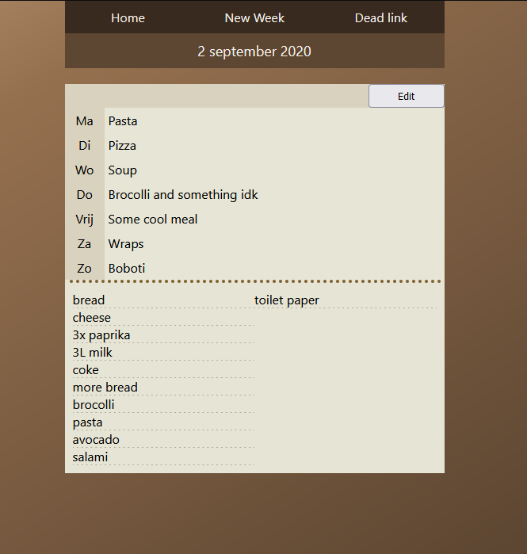

# Household dashboard

This is a react based web app to assist with various of our household tasks. For now it's main purpose is to help with making our weekly meal/shopping-lists. The view/controller component are written with [React](https://reactjs.org/) while the model component is written in python using [Flask](https://flask.palletsprojects.com/en/2.0.x/).

# Demo

A demo is available at [COMING SOON].

The username and password are "demo".

### Screenshots

# Installation

The project requires npm and react for the website and flask and bcrypt for the web api.

To run the web api simply run "python .\flask_api.py" or "python3 .\flask_api.py" from the "/server/" directory. Change the "DATA_SERVER_URL" variable in "/src/config.json" to the url of this server. To build a production version of the react app clone this repository and change run "npm run build". This creates a build folder which can then be served using a webserver of your choosing. The password is sent in plaintext to the api when acquiring a login token (this will be changed later), so HTTPS should be used to protect the credentials.

# TODO/Known issues
 - Fetch errors aren't caught correctly. They are caught on the json parse promise which will still fail if the api responds with an error but prevents providing useful error messages.
 - Passwords should also be hashed client-side to protect passwords sent over insecure connections.
 - The WeekList component is getting a bit crowded. Top and bottom sections should be spun of into their own components.
 - Currently login tokens do not expire.
 - Updating a weeklist should be done using a PUT request rather than a POST.
 - Implement cleanup of useEffect fetches.
 - Create a logo/favicon
 - Salt is appended to hash, so doesn't need to be saved seperatly.
  
# Future features
- Save meals as proper objects in database with information on recipes, ingredients, vegetarian etc
	- Provide option to add new meals
	- Suggest previous meals when creating a new WeekList
	- Auto-fill shopping list based on ingredients
- Save shopping items as proper objects in database with information on price, location in store
	- Provide option to add new shopping items
	- Provide estimated price on shopping lists
	- Auto sort shopping list based on location in store for optimal shopping route
- Allow inputting of store reciepts
	- Allow for auto updating shopping item prices
	- Provide shopping statistics
- Expand app to properly support multiple users (logout, register, different access levels)
